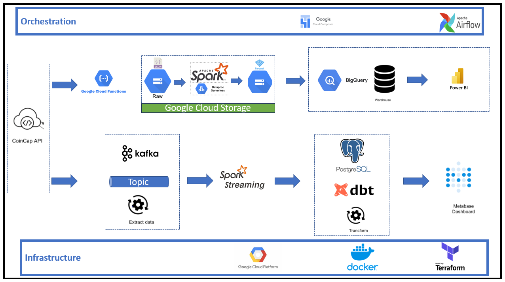

# [Portofolio] - ShowNotTell - CYRIL - NJITARI - #1 - CoinCap API

## Problem Description
The cryptocurrency market is highly volatile and can present significant opportunities and risks for investors. Having access to real-time market data, analyses, and personalized notifications can greatly enhance investment decisions. However, real-time processing and analysis of large volumes of market data can be complex, requiring a robust, scalable, and flexible architecture.

-------------------

## Project Objectives
- Efficiently and securely store data using a combination of databases and streaming technologies.
- Analyze the data to generate useful insights, such as market trends.
- Enable users to set custom alerts based on specific criteria. 
- Ensure the system's reliability and scalability to handle data spikes and potential failures.
- Continuously collect cryptocurrency price data via the CoinCap API.
-------------------
## Project Architecture, Infrastructure and Orchestration:

## System Design
The architecture outlined provides a high-level view of the data pipeline and processing infrastructure designed to meet the project's objectives. Below is a detailed description of each component and their role in the system.

1. **Data Ingestion:
CoinCap API: Serves as the data source, providing real-time cryptocurrency prices and market changes.
Google Cloud Functions: These serverless functions are triggered to pull data from the CoinCap API at regular intervals, ensuring fresh data is always available for processing.

2. **Data Processing and Storage:
Kafka: As a distributed streaming platform, Kafka queues raw data streams, allowing for decoupling between data ingestion and processing layers, thus providing robustness and scalability.
Spark & Spark Streaming: These components are responsible for the heavy lifting of data processing. Apache Spark processes batch data, while Spark Streaming handles real-time data analytics.
Google Cloud Storage: It acts as a raw data lake, storing large volumes of unprocessed data in a cost-effective manner.

3. **Data Analysis and Orchestration:
BigQuery: This fully-managed data warehouse is used for running queries on large datasets. It enables the analysis of data stored in Google Cloud Storage.
Apache Airflow: Orchestrates the workflow, scheduling, and running tasks, ensuring that the data pipeline runs smoothly and efficiently.

4. **Data Transformation and Loading:
PostgreSQL & dbt: PostgreSQL serves as the operational database, with dbt (data build tool) being used to transform data inside the database for analytics purposes.

5. **Data Visualization and Alerting:
Power BI: Connects to BigQuery to visualize data and create interactive reports and dashboards.
Metabase: An open-source dashboard tool connected to PostgreSQL to provide business intelligence insights and data visualization.

6. **Infrastructure Management:
Docker: Containers are used to package and deploy applications, ensuring consistency across different development and production environments.
Terraform: An infrastructure-as-code tool used to define and manage the cloud infrastructure declaratively, allowing for reproducibility and automation of the deployment process.

## Development & Deployment

How to Run the System
instructions for setting up and running the system, including prerequisites, configuration settings, and command line instructions for running the services.

coming soon

## Monitoring, Alerting, and Reliability
system monitoring strategy, alerting mechanisms, and how reliability is ensured across the pipeline.

coming soon

## Security Measures
security protocols implemented for data protection.

coming soon

## Challenges and Solutions
coming soon 

## Conclusion and Future Work
coming soon

