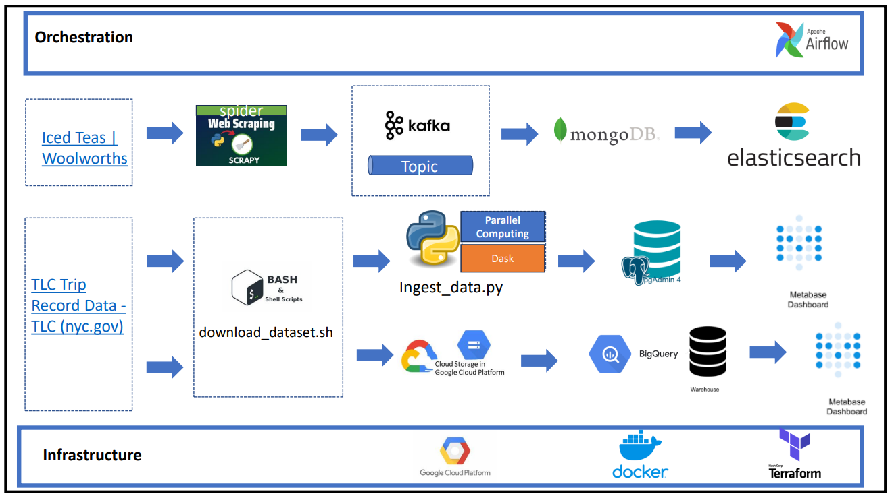

# [Portofolio] - ShowNotTell - CYRIL - NJITARI - #2 - NYT_SCRAPING_WoolworthsShop
## Problem Description
In the retail industry, data from various sources like product listings, customer reviews, and transaction records are pivotal for making informed business decisions. 
Retailers need a system that not only aggregates data from diverse sources but also enables rapid search and analytics to improve customer experience and operational efficiency.
-------------------

## Project Objectives
- Establish a data pipeline that aggregates product data from retail websites and transaction records efficiently.
- Ensure data is easily queryable and supports complex analytical queries for market trend analysis.
- Implement a scalable solution that can handle an increasing volume of data from multiple sources.
- Provide stakeholders with a user-friendly dashboard for insights and reporting.

-------------------
### Project Architecture Infrastructure and Orchestration:

The project leverages a robust stack of technologies including web scraping tools, message brokers, parallel computing, databases, and search engines orchestrated through Apache Airflow to deliver a comprehensive data pipeline.

## System Design

1. Data Sources:
- Iced Teas at Woolworths: Product data scraped using Scrapy from Woolworths’ online store.
- TLC Trip Record Data: Public transportation datasets available at nyc.gov, representing a different aspect of retail operations and logistics.
2. Orchestration Layer:
- Apache Airflow: Orchestrates the workflow ensuring that the data pipeline is reliable and data is consistently processed and updated.
3. Data Ingestion:
- Scrapy: An open-source web-crawling framework used to extract the product data.
- BASH Scripts: Used for automating the download of large datasets from government sites.
4. Data Processing and Storage:
- Kafka: Acts as a messaging system to handle the stream of data coming from different sources.
- Dask: A flexible parallel computing library for analytics, integrating with Python to process large datasets.
- MongoDB: A NoSQL database used to store scraped and processed data.
- BigQuery: Data warehouse solution for storing and querying massive datasets efficiently.
- Elasticsearch: A search engine that provides a distributed, multitenant-capable full-text search engine with an HTTP web interface and schema-free JSON documents.
5. Analytics and Visualization:
- Metabase: An open-source business intelligence tool that lets you create charts and dashboards using data from MongoDB and BigQuery.
6. Infrastructure and Deployment:
- Google Cloud Platform (GCP): Hosts the cloud services and infrastructure for the project.
- Docker: For containerizing the application, ensuring consistency across development, staging, and production environments.
- Terraform: For defining infrastructure as code, making the setup reproducible and consistent.

## Project Setup and Execution
Instructions on how to set up the project environment, execute the data pipeline, and deploy the services.

Coming soon 

## Data Models and Transformations
structure of data in MongoDB and BigQuery, transformations performed, and how Elasticsearch indexes the data for fast retrieval.

coming soon

## Visualization and Business Insights
how Metabase is utilized for creating dashboards that deliver key business insights from the processed data.

coming soon

## Monitoring, Alerting, and Reliability
system monitoring strategy, alerting mechanisms, and how reliability is ensured across the pipeline.

coming soon

## Security Measures
security protocols implemented for data protection.

coming soon

## Challenges and Solutions

coming soon 

## Conclusion and Future Work

coming soon

