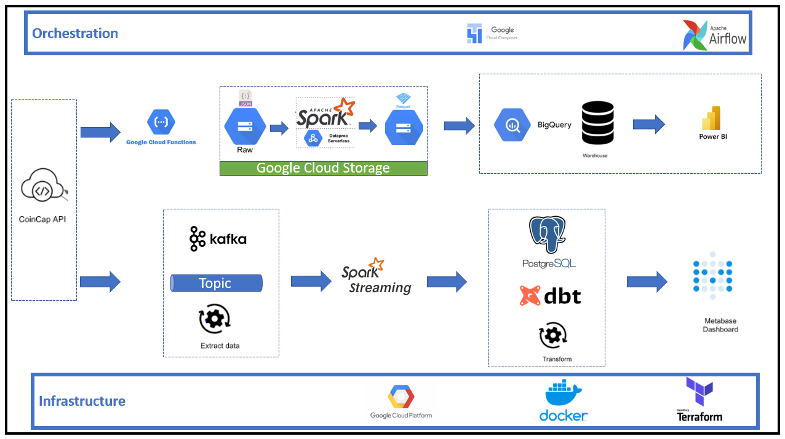
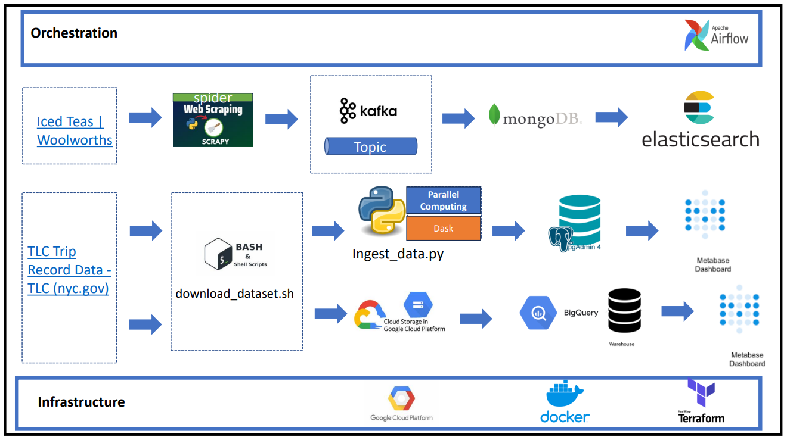
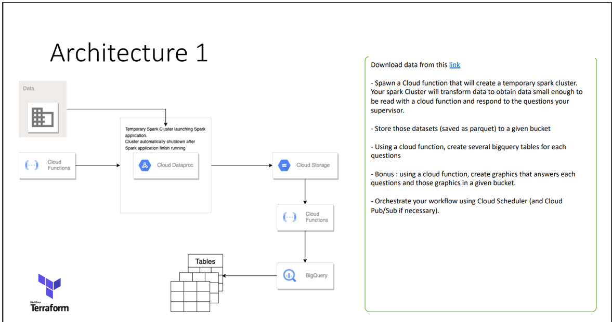
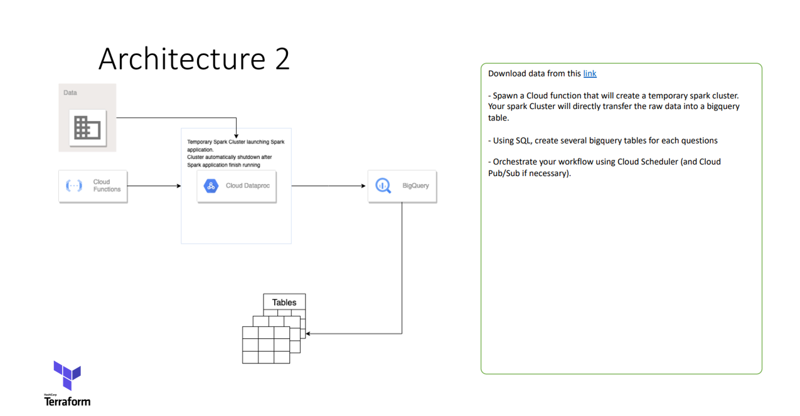
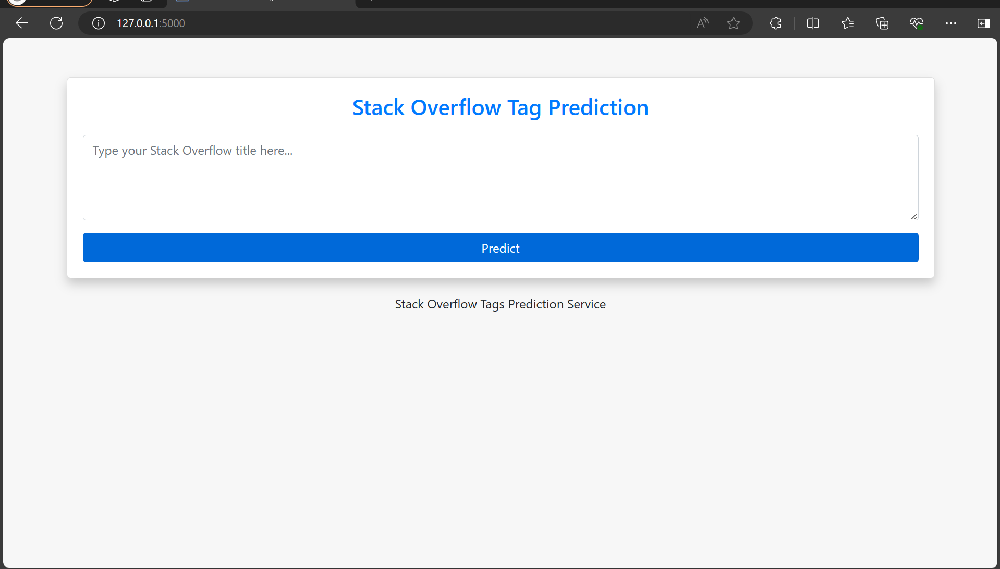

# [Portfolio] - ShowNotTell - CYRIL - NJITARI 

## 👋 Introduction
Hi, my name is Cyril!

Welcome to my professional portfolio! Here, I showcase a collection of projects that demonstrate my expertise in data engineering, machine learning, and software development. Each project illustrates my problem-solving capabilities, technical skills, and creativity in tackling complex data challenges. Let's dive into the projects that mark my journey in the data engineering field.

## 🚀 Projects

## Table of Contents

- [ShowNotTell #1 - CoincapStreamline](#shownottell-1---coincapstreamline)
- [ShowNotTell #2 - NYT SCRAPING WoolworthsShop](#shownottell-2---nyt-scraping-woolworthsshop)
- [ShowNotTell #3 - CrimeAnalytics GCP](#shownottell-3---crimeanalytics-gcp)
- [ShowNotTell #4 - FastAPIForClassification](#shownottell-4---fastapiforclassification)
- [ShowNotTell #5 - FROM POC TO PROD StackOverflow Tag Prediction Service](#shownottell-5---from-poc-to-prod-stackoverflow-tag-prediction-service)
- [ShowNotTell #6 - GA Reuseability Genetic Algorithms Optimization](#shownottell-6---ga-reuseability-genetic-algorithms-optimization)

### [ShowNotTell #1 - CoincapStreamline](https://github.com/CYRIL-NJITARI10/-Portofolio---ShowNotTell---CYRIL---NJITARI/tree/main/CoincapStreamline)
This project is a robust data engineering solution designed to handle real-time data processing and analysis, providing insights into cryptocurrency market trends. The architecture is built to ingest data from the CoinCap API, process and analyze this data through various stages, and ultimately present it in an accessible format for business intelligence and data-driven decision making.

#### **Key Technologies**: 
- Data Ingestion: CoinCap API, Google Cloud Functions
- Streaming and Messaging: Apache Kafka, Spark Streaming
- Storage: Google Cloud Storage, BigQuery
- Data Processing: Apache Spark on Cloud Dataproc
- Database: PostgreSQL
- Transformation: dbt (data build tool)
- Orchestration: Apache Airflow via Google Cloud Composer
- Visualization: Power BI, Metabase
- Infrastructure: Docker, Terraform
- unit and integration tests: pytest, unittest, mock

This system is designed with scalability in mind, ensuring that as data volume grows, the infrastructure can handle increased loads without degradation of performance. The use of containerization and infrastructure as code principles demonstrates a modern approach to cloud infrastructure management, allowing for reproducibility and automation.

- [View Project](https://github.com/CYRIL-NJITARI10/-Portofolio---ShowNotTell---CYRIL---NJITARI/tree/main/CoincapStreamline)

---
### [ShowNotTell #2 - NYT SCRAPING WoolworthsShop](https://github.com/CYRIL-NJITARI10/-Portofolio---ShowNotTell---CYRIL---NJITARI/tree/main/NYT_SCRAPING_WoolworthsShop)

The project leverages a robust stack of technologies including web scraping tools, message brokers, parallel computing, databases, and search engines orchestrated through Apache Airflow to deliver a comprehensive data pipeline.

#### **Key Technologies**: 
- Web Scraping: Scrapy for extracting product data.
- Messaging: Apache Kafka for handling data streams.
- Parallel Computing: Dask for processing data in parallel.
- Databases: MongoDB for document storage, Elasticsearch for search capabilities, and PostgreSQL for relational data storage.
- Data Ingestion and Workflow Orchestration: Apache Airflow for scheduling and monitoring pipelines.
- Containerization and Infrastructure as Code: Docker and Terraform for creating reproducible and scalable environments.
- Visualization and Business Intelligence: Metabase for dashboarding and data insights.

This solution illustrates a sophisticated approach to handling real-time data from various sources, transforming it into actionable insights through a resilient, scalable, and maintainable infrastructure.

- [View Project](https://github.com/CYRIL-NJITARI10/-Portofolio---ShowNotTell---CYRIL---NJITARI/tree/main/NYT_SCRAPING_WoolworthsShop)

---
### [ShowNotTell #3 - CrimeAnalytics GCP](https://github.com/CYRIL-NJITARI10/-Portofolio---ShowNotTell---CYRIL---NJITARI/tree/main/CrimesAnalysis_GCP)

This project implements two distinct architectural designs for processing and analyzing crime data, aiming to deliver a versatile and efficient data workflow that can adapt to varying analytical requirements.

#### **Architecture 1**

Utilizes a serverless approach with Google Cloud Functions to trigger data processing pipelines in response to events. The data is processed through a temporary Spark cluster on Google Cloud Dataproc, with the resulting datasets stored in Cloud Storage and BigQuery.

#### **Architecture 2**

Directly transfers data from the temporary Spark cluster to BigQuery, eliminating intermediate storage, and streamlining the data processing workflow.

#### **Key Technologies**: 
- Data Ingestion: Cloud Functions for triggering data processing workflows.
- Big Data Processing: Cloud Dataproc for running Apache Spark clusters.
- Data Storage: Google Cloud Storage for raw data and BigQuery for storing processed data.
- Orchestration: Apache Airflow for managing and orchestrating the data processing pipelines.
- Infrastructure Management: Terraform for provisioning and managing cloud resources.

#### **Additional Features**: 
- SQL-based analysis in BigQuery for querying large datasets.
- Cloud Scheduler for scheduling workflows.
- Cloud Pub/Sub for message queuing and asynchronous task execution.
- Automated data download and ingestion via shell scripts and cloud functions.

This project's architecture is designed to be robust and scalable, capable of handling large volumes of data with the flexibility to adapt to different data sources and analytical requirements.

- [View Project](https://github.com/CYRIL-NJITARI10/-Portofolio---ShowNotTell---CYRIL---NJITARI/tree/main/CrimesAnalysis_GCP)
---

### [ShowNotTell #4 - FastAPIForClassification](https://github.com/CYRIL-NJITARI10/-Portofolio---ShowNotTell---CYRIL---NJITARI/tree/main/FastAPIForClassification)

This project showcases a FastAPI application that serves a machine learning model for making predictions on the Iris Flower dataset. A RESTful API has been developed to encapsulate data processing and machine learning logic, making it accessible and easy to use for accurate and quick Iris species classification.

#### Project Implementation

- Developed a RESTful API providing seamless interaction with a machine learning model using stateless HTTP requests.
- Created a data ingestion process to prepare the Iris Flower dataset for analysis.
- Implemented data preprocessing, transformation, and model training using a Scikit-Learn classification model.
- Constructed a complete machine learning workflow from data acquisition to model prediction.
- Integrated Google Firestore for dynamic model parameter management.

#### Key Technologies: 
- **FastAPI**: For building efficient and high-performing APIs.
- **Scikit-Learn**: For model training and predictions.
- **Google Firestore**: For storing and managing model parameters.
- **Pandas**: For data manipulation and preprocessing.

#### Features:
- API endpoints for model training, prediction, and parameter updates.
- Well-documented and user-friendly API design.
- Dynamic management of machine learning model parameters.
- Full utilization of FastAPI features for high performance.

This FastAPI project not only demonstrates the application's ability to solve the classification problem at hand but also exhibits the scalability and potential for broader use cases in predictive analytics.

- [View Project](https://github.com/CYRIL-NJITARI10/-Portofolio---ShowNotTell---CYRIL---NJITARI/tree/main/FastAPIForClassification)
---
### [ShowNotTell #5 - FROM POC TO PROD StackOverflow Tag Prediction Service](https://github.com/CYRIL-NJITARI10/-Portofolio---ShowNotTell---CYRIL---NJITARI/tree/main/FROM_POC_TO_PROD)

This project features a transition from a proof of concept to a production-ready Flask web application. It predicts StackOverflow tags using a machine learning model, emphasizing the importance of software engineering best practices.

Embarks on a journey from a simple prototype to a fully functional production application. It encapsulates key aspects of software engineering to deliver a user-friendly, scalable, and robust service capable of text classification using machine learning models.

#### **Key Technologies**: 
- **OOP**: Object, Polymorphism, Encapsulation, Inheritance, Abstraction
- **Flask**: Web framework for developing the server-side application.
- **TensorFlow & Keras**: For building and running the neural network model.
- **Bootstrap**: For designing a responsive user interface.
- **BERT**: As the text embedding model for converting question titles to vector format.

#### **Features**: 
- Seamless user interaction with a clean and straightforward UI.
- Accurate and fast predictions of StackOverflow tags using a trained neural network.
- Scalable architecture ready for high demand and future feature integrations.
- Comprehensive testing suite ensuring reliability and robustness of the service.

#### **Development and Testing**: 
- Detailed Flask application with routes and service logic.
- Thorough test coverage with unittest for all components of the application, ensuring quality and performance.

This project exemplifies a sophisticated implementation of machine learning models in a web application, demonstrating the practical use of NLP in improving content categorization and searchability on platforms like StackOverflow.

- [View Project](https://github.com/CYRIL-NJITARI10/-Portofolio---ShowNotTell---CYRIL---NJITARI/tree/main/FROM_POC_TO_PROD)

---
### [ShowNotTell #6 - GA Reuseability Genetic Algorithms Optimization](https://github.com/CYRIL-NJITARI10/-Portofolio---ShowNotTell---CYRIL---NJITARI/tree/main/GA_Reusability)

GA_Reuseability offers a sophisticated software framework that leverages Object-Oriented Programming principles to solve optimization problems with genetic algorithms. This versatile package is designed to address complex challenges like the Traveling Salesperson Problem (TSP) and strategic games such as Mastermind.

#### **Project Insights**

This project takes advantage of genetic algorithms' flexibility, providing a modular solution applicable to diverse optimization scenarios. The reusability and maintainability of the code are enhanced by solid OOP design, including inheritance, encapsulation, and polymorphism.

#### **Key Technologies**: 
- **Object-Oriented Programming**: For constructing a reusable and maintainable genetic algorithm framework.
- **Python**: As the primary programming language for developing the software package.

#### **Core Components**: 
- **Generic Genetic Algorithm Solver**: A foundational solver class that encapsulates the genetic algorithm logic.
- **Problem-Specific Extensions**: Derived classes for TSP and Mastermind that build upon the base GAProblem class.
- **Customization**: Options to tweak selection rates and mutation rates for algorithm refinement.
- **Evolution Process Visualization**: Tools to visualize the evolving solution, particularly useful in the TSP to plot the optimal route.

This project not only resolves specific optimization issues but also serves as a template for genetic algorithm applications, highlighting the efficacy of OOP in developing scalable, adaptable software solutions.

- [View Project](https://github.com/CYRIL-NJITARI10/-Portofolio---ShowNotTell---CYRIL---NJITARI/tree/main/GA_Reusability)

## 🛠️ Hard Skills

### Programming and Software Development
- **Python**: Advanced proficiency for software development, data analysis, and machine learning. Efficient use of libraries such as Pandas, Scikit-Learn, FastAPI, and TensorFlow.
- **Web Development**: Development of web applications with Flask and FastAPI, including creating RESTful APIs for machine learning services.
- **Frontend Development**: Experience in using Bootstrap to craft responsive and visually appealing user interfaces.

### Data Engineering
- **Data Pipelines**: Design and implementation of robust, scalable data pipelines using Apache Airflow, Apache Kafka, and Google Cloud Platform (GCP), including Cloud Functions, BigQuery, and Cloud Dataproc.
- **Databases**: Proficient in SQL (PostgreSQL) and NoSQL databases (MongoDB, Firestore), as well as data storage solutions like Google Cloud Storage.
- **Data Transformation**: Skilled in using dbt (data build tool) for data transformation and orchestrating complex data workflow operations.

### Infrastructure and DevOps
- **Containerization**: Container configuration and management with Docker.
- **Infrastructure as Code**: Infrastructure deployment and management using Terraform.

### Data Analysis and Machine Learning
- **Machine Learning**: Experience in developing and deploying models, including neural networks with TensorFlow and Keras, and using BERT for NLP.
- **Optimization Techniques**: Use of genetic algorithms to solve complex problems like the Traveling Salesman Problem (TSP).

## 👥 Soft Skills

### Problem-Solving
- Analytical and creative thinking process for solving complex issues, demonstrated by the design of data engineering and machine learning solutions.

### Teamwork and Communication
- Effective communication of technical ideas to diverse audiences and collaboration with stakeholders to achieve common goals.

### Project Management and Leadership
- Skills in planning, monitoring progress, and adapting to changes. Demonstrated leadership in driving projects from concept to production.

### Continuous Learning and Adaptability
- Commitment to continuous learning and rapid adaptability to new technologies and methodologies.

### Creativity and Innovation
- Creativity in designing solutions and innovation in applying data engineering and machine learning principles to produce meaningful outcomes.

## 💬 Languages

- **Français** : Langue maternelle
- **Anglais** : Courant (B2)

## 📬 Contact Information
Should you have any questions or wish to connect, please feel free to reach out through:

- **LinkedIn** : [Cyril MFOPOU](https://www.linkedin.com/in/cyril-dilane-mfopou-njitari-b833b7207/)
- **Email** : [cyrilnjitari7@gmail.com](mailto:cyrilnjitari7@gmail.com)

